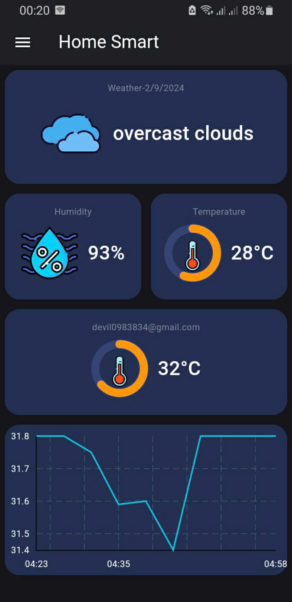

# dashboard

Hệ thống điều khiển và giám sát thông minh, giúp người dùng theo dõi thời tiết theo thời gian thực với các thông số như nhiệt độ, độ ẩm, ánh sáng và chất lượng không khí, đồng thời điều khiển thiết bị ESP32 từ xa thông qua kết nối WiFi (HTTP) hoặc Bluetooth (BLE).

#Sơ đồ chức năng

  

#Sơ đồ luồng dữ liệu mức đỉnh

  

#Sơ đồ luồng dữ liệu của chức năng quản lý người dùng, hiển thị thời tiết.

  

#Sơ đồ luồng dữ liệu  của chức năng điều khiển ESP32

  

#Giao diện trang home

  

